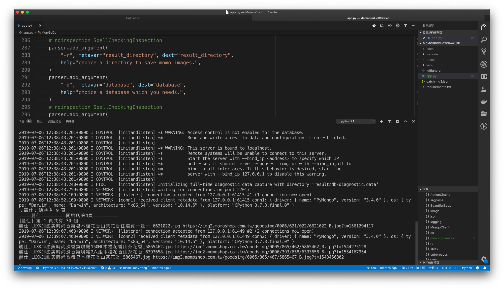

# MomoProductCrawler

This is a crawler script for MOMO website, to get vendor information, image there. 
* Developed with python. Use selenium open browser to connect website and get the vendor info which extracting all the image URL and information through BeautifulSoup library from html, then download vendor’s image and stored vendor’s name, price, category, vendor name, etc… to MongoDB.

## Get Started

### Environment

```
$ brew install python3
$ curl https://bootstrap.pypa.io/get-pip.py -o get-pip.py
$ python3 get-pip.py
$ pip install virtualenv
$ git clone git@gitlab.com:surpasstw/paritytw/MomoProductCrawler.git
$ cd MomoProductCrawler
```
Create an independent environment
```
$ virtualenv venv
```
Entering the environment
```
$ source venv/bin/activate
```
Install requirement packages
```
$ pip3 install -r requirements.txt
```
Install mongodb
```
$ brew install mongodb
```

### Run

```
$ mkdir -p result/db
$ python app.py -r result -d mongo -dbpath result/db
```

## Screenshots


